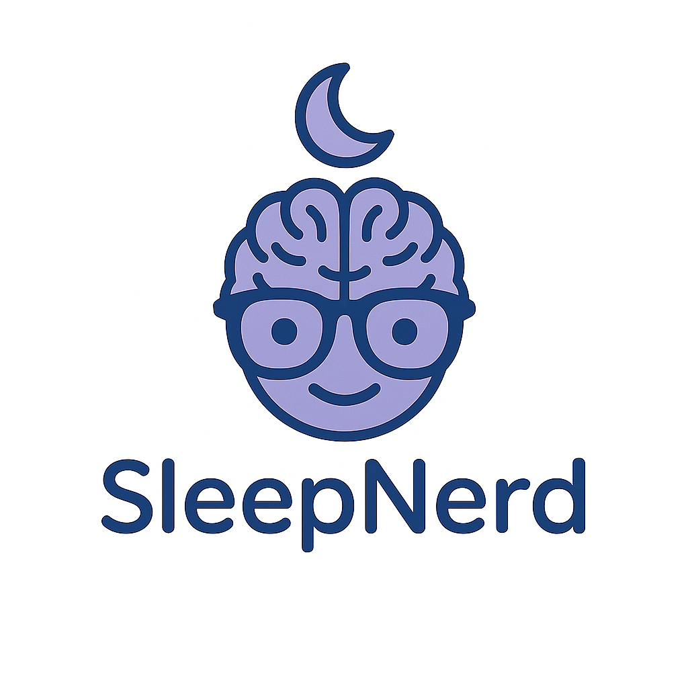

<div align="left" style="display: flex; flex-wrap: wrap; align-items: center; gap: 20px;">
  
  
  <div>
    <h2 style="margin-bottom: 0;">OSA Phenotype Engine</h2>
    <em>From signal to insight</em>
  </div>
</div>


# OSAPhenotype
Automated phenotyping pipeline for sleep studies (EDF+XML) with batch processing, Excel export, and tray monitor

# Sleep Study Trait Extraction Pipeline

This pipeline processes full-night EDF+XML sleep studies and extracts phenotype traits including:

- Vpassive / Vactive ventilation
- Arousal threshold
- Compensation
- Loop gain (future integration)

## How to Run

```bash
python batch_run.py --folder ./data --strategy supine_NREM
